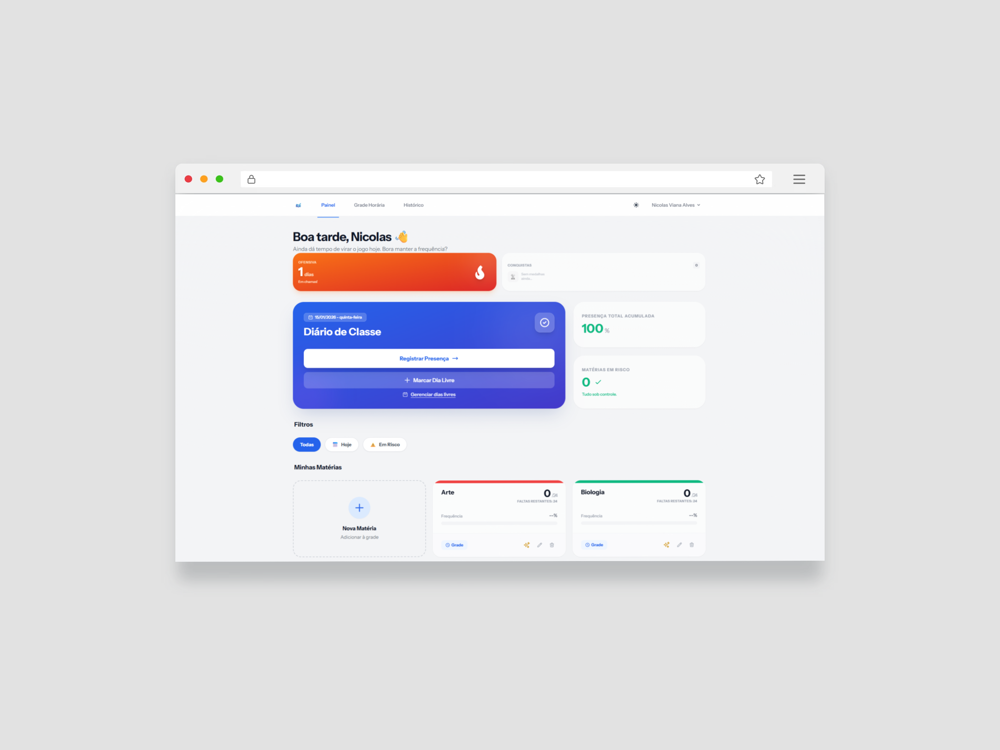
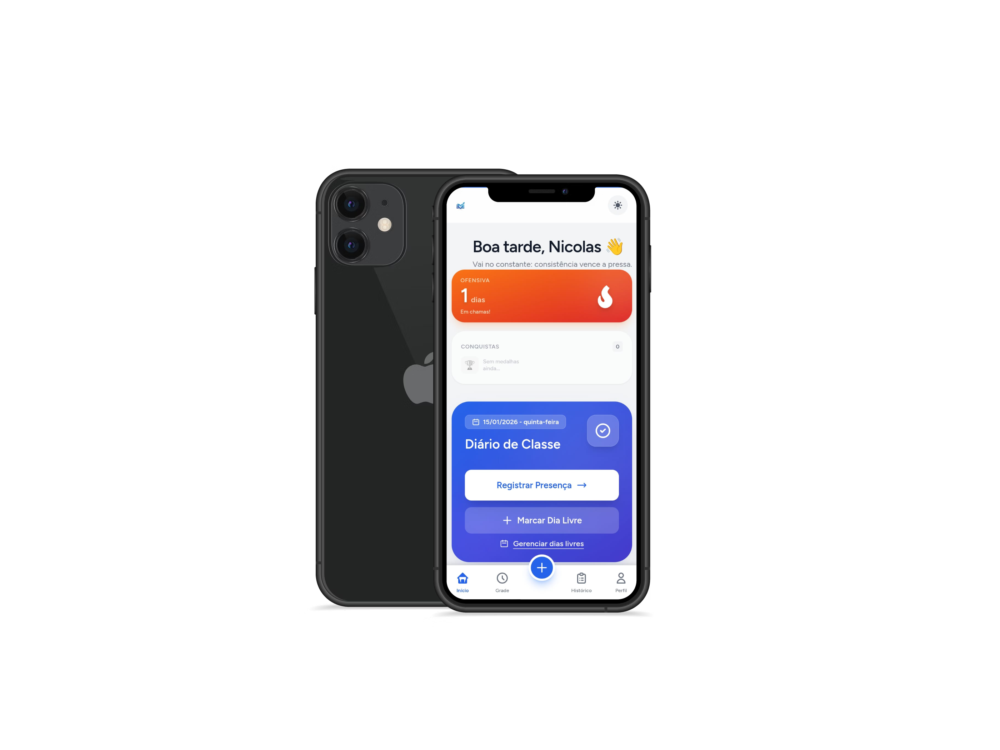
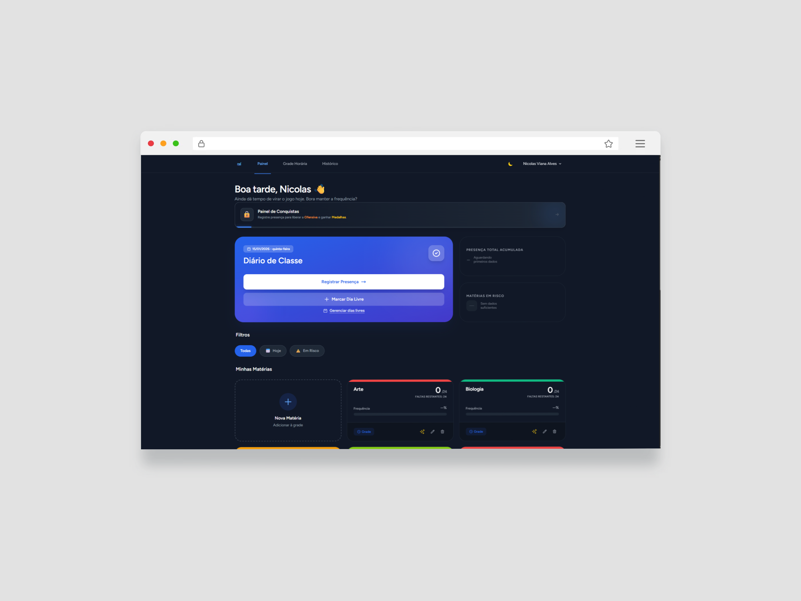
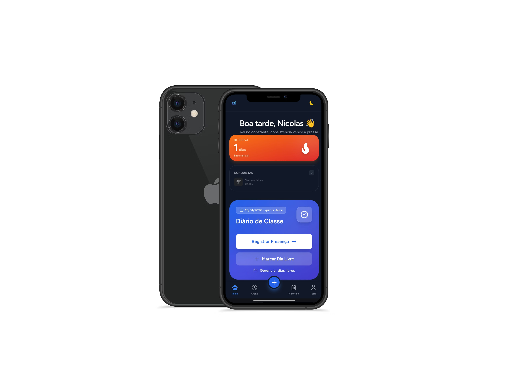

# 🎓 Frequência Certa


> **Sistema Inteligente de Gestão e Controle de Frequência Escolar.**

---

## 📖 Sobre o Projeto

O **Frequência Certa** é uma solução híbrida (Web e PWA) desenvolvida para empoderar estudantes do ensino médio e técnico no gerenciamento de sua assiduidade escolar.

Além de mitigar a evasão e auxiliar no cumprimento de requisitos para benefícios como o **Pé-de-Meia**, o sistema evoluiu para oferecer uma experiência de usuário moderna e engajadora. Operando como uma **Progressive Web App (PWA)**, o sistema oferece navegação fluida, gamificação para incentivar a constância e um assistente de IA para análise de riscos.

### 🚀 Novas Funcionalidades (v2.0)

- **⚡ Interface Moderna:** Design responsivo e interativo, otimizado para experiência mobile-first com animações sutis via GSAP.
- **🔮 Oráculo Acadêmico (IA):** Um assistente virtual integrado (Google Gemini) que analisa o histórico do aluno via chat e oferece conselhos personalizados sobre faltar ou não.
- **🏆 Gamificação & Conquistas:** Sistema de medalhas e "ofensivas" (streaks) para recompensar alunos que mantêm a frequência e o registro em dia.
- **🔔 Notificações Push:** Lembretes automáticos enviados diretamente ao dispositivo para registrar a chamada ou alertar sobre limites de faltas.

### 🌟 Funcionalidades Essenciais

- **📱 Mobile First & PWA:** Instalável no celular (Android/iOS) com suporte offline.
- **📅 Grade Dinâmica:** Montagem flexível de horários semanais.
- **📊 Inteligência de Dados:** Projeção automática de dias letivos e cálculo percentual em tempo real.
- **🚦 Alertas Semafóricos:** Indicadores visuais (Verde/Amarelo/Vermelho) de risco.
- **🗓️ Gestão de Eventos:** Cadastro de feriados e dias sem aula.

---

## 📸 Demonstração

<details>
  <summary align="center"><strong>Clique para ver o Modo Claro (Light Mode)</strong></summary>
  <br>

  <table align="center">
    <tr>
      <td align="center">
        
      </td>
      <td align="center">
        
      </td>
    </tr>
  </table>
</details>

<details>
  <summary align="center"><strong>Clique para ver o Modo Escuro (Dark Mode)</strong></summary>
  <br>

  <table align="center">
    <tr>
      <td align="center">
        
      </td>
      <td align="center">
        
      </td>
    </tr>
  </table>
</details>


---

## 🛠️ Stack Tecnológica

Arquitetura moderna foca em performance, interatividade e experiência do usuário (UX):

| Front-end & Interface | Back-end & Infraestrutura | Bibliotecas & Serviços |
| :--- | :--- | :--- |
|  **HTML5** |  **Laravel 12** |  **GSAP (Animações)** |
|  **Tailwind CSS** |  **PHP 8.2** |  **Google Gemini AI** |
|  **Alpine.js** |  **MySQL** |  **SweetAlert2** |
|  **Service Workers** |  **Filament Admin** |  **Firebase Auth** |

---

## ✅ Pré-requisitos

- PHP 8.2+
- Composer
- Node.js + npm
- MySQL (ou MariaDB)

---

## 👥 Equipe de Desenvolvimento

| Integrante | Funções Principais | GitHub |
| :--- | :--- | :--- |
| **Nicolas Viana Alves** | Full-Stack, Documentação & Deploy | [@naicolas-dev](https://github.com/naicolas-dev) |
| **Bruno Felix Seixas** | Front-end, PWA & UI/UX | [@obrunofelix](https://github.com/obrunofelix) |
| **Igor Thiago Costa Rodrigues** | Back-end & QA | [@luxxzvh](https://github.com/luxxzvh) |

---

## 🚀 Como rodar o projeto localmente

1. Clone o repositório:
```bash
git clone <URL_DO_REPOSITORIO>
cd <NOME_DO_PROJETO>
```
2. Instale as dependências:
```bash
composer install
npm install
```
3. Configure o ambiente:
```bash
cp .env.example .env
php artisan key:generate
```
4. Configuração de APIs (Essencial): Adicione as chaves necessárias no seu arquivo .env:
```env
# API de Feriados (Para feriados estaduais)
INVERTEXTO_API_KEY=sua_chave_invertexto

# IA do Oráculo (Obrigatório para o chat)
GEMINI_API_KEY=sua_chave_google_gemini

# Notificações Push (WebPush)
VAPID_PUBLIC_KEY=sua_chave_publica_vapid
VAPID_PRIVATE_KEY=sua_chave_privada_vapid
```
5. Configure o banco de dados e migre:
```bash
php artisan migrate --seed
```
6. Inicie o servidor:

Terminal 1 (Backend):
```bash
php artisan serve
```
Terminal 2 (Frontend & Watcher):
```bash
npm run dev
```
Acesse o projeto em: http://localhost:8000

## ⚠️ Disclaimer

Este sistema foi desenvolvido **exclusivamente para fins acadêmicos**, como parte de um Trabalho de Conclusão de Curso (TCC).

As informações de frequência apresentadas pelo sistema representam **estimativas baseadas na grade horária definida pelo estudante, nos registros de presença realizados e nos dias não letivos informados**, não devendo ser interpretadas como registros oficiais ou documentos válidos para comprovação institucional.

O projeto **não substitui sistemas oficiais de controle escolar**, diários de classe ou registros administrativos das instituições de ensino.
## 📄 Licença
Este projeto está sob a licença MIT. Consulte o arquivo LICENSE para mais detalhes.

---

<div align="center"> <sub>Projeto de caráter acadêmico e demonstrativo. <br>© Desenvolvido para o Curso Técnico em Desenvolvimento de Sistemas – 2025/2026.</sub> </div>
