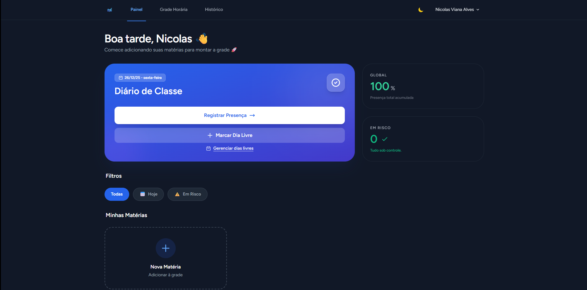
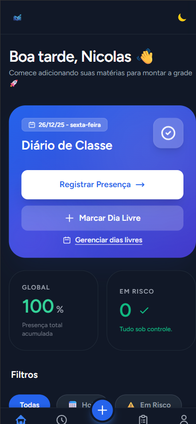

# 🎓 Frequência Certa


> **Sistema de Gestão e Controle de Frequência Escolar.**

---

## 📖 Sobre o Projeto

O **Frequência Certa** é uma solução híbrida (Web e PWA) desenvolvida para empoderar estudantes do ensino médio e técnico no gerenciamento de sua assiduidade escolar.

O objetivo central é mitigar a evasão e a reprovação por faltas, além de auxiliar no monitoramento de requisitos para benefícios governamentais (como o **Pé-de-Meia**), que exigem frequência mínima de 80%. Através de uma interface intuitiva, o aluno consegue projetar seu desempenho e receber alertas visuais antes de atingir limites críticos.

### 🚀 Principais Funcionalidades

- **📱 Mobile First & PWA:** Aplicação instalável no celular (Android/iOS).
- **📅 Grade Dinâmica:** Montagem flexível de horários semanais adaptada à realidade do ensino técnico.
- **📊 Inteligência de Dados:** Projeção automática de dias letivos e cálculo percentual de presença em tempo real.
- **🚦 Alertas Semafóricos:** Indicadores visuais (Verde/Amarelo/Vermelho) que sinalizam o risco de reprovação por disciplina.
- **🗓️ Gestão de Eventos:** Cadastro de feriados e dias sem aula para garantir a precisão dos cálculos.
- **📄 Relatórios:** Geração de histórico de presença (Web).

---

## 📸 Demonstração

<div align="center">
  
  <br><br>
  
</div>

---

## 🛠️ Stack Tecnológica

O projeto utiliza uma arquitetura moderna focada em performance e experiência do usuário:

| Front-end & Interface | Back-end & Infraestrutura | Ferramentas de Dev |
| :--- | :--- | :--- |
|  **HTML5** |  **Laravel 12+** |  **Git** |
|  **Tailwind CSS** |  **PHP 8.2** |  **VS Code** |
|  **Alpine.js** |  **MySQL** |  **GitHub** |
|  **Service Workers** | | |

---

## ✅ Pré-requisitos

- PHP 8.2+
- Composer
- Node.js + npm
- MySQL (ou MariaDB)
---
## 👥 Equipe de Desenvolvimento

| Integrante | Funções Principais | GitHub |
| :--- | :--- | :--- |
| **Nicolas Viana Alves** | Full-Stack, Documentação & Deploy | [@naicolas-dev](https://github.com/naicolas-dev) |
| **Bruno Felix Seixas** | Front-end, PWA & UI/UX | [@obrunofelix](https://github.com/obrunofelix) |
| **Igor Thiago Costa Rodrigues** | Back-end & QA | [@luxxzvh](https://github.com/luxxzvh) |

---

## 🚀 Como rodar o projeto localmente

1. Clone o repositório:
```bash
git clone <URL_DO_REPOSITORIO>
cd <NOME_DO_PROJETO>
```
2. Instale as dependências do PHP:
```bash
composer install
```
3. Instale as dependências do Front-end:
```bash
npm install
```
4. Configure o arquivo .env:
```bash
cp .env.example .env
php artisan key:generate
```

5. Crie sua chave em: https://api.invertexto.com

Adicione no .env:
```env
INVERTEXTO_API_KEY=SUACHAVE_AQUI
```
6. Configure o banco de dados no .env e rode as migrations:
```bash
php artisan migrate
```
7. Inicie o servidor em dois terminais

**Terminal 1**
```bash
php artisan serve
```
**Terminal 2**
```bash
npm run dev
```
Acesse o projeto em: http://localhost:8000

---
## ⚠️ Disclaimer

Este sistema foi desenvolvido **exclusivamente para fins acadêmicos**, como parte de um Trabalho de Conclusão de Curso (TCC).

As informações de frequência apresentadas pelo sistema representam **estimativas baseadas na grade horária definida pelo estudante, nos registros de presença realizados e nos dias não letivos informados**, não devendo ser interpretadas como registros oficiais ou documentos válidos para comprovação institucional.

O projeto **não substitui** sistemas oficiais de controle escolar, diários de classe ou registros administrativos das instituições de ensino.


## 📄 Licença
Este projeto está sob a licença MIT. Consulte o arquivo LICENSE para mais detalhes.

---

<div align="center"> <sub>Projeto de caráter acadêmico e demonstrativo. <br>© Desenvolvido para o Curso Técnico em Desenvolvimento de Sistemas – 2025/2026.</sub> </div>
